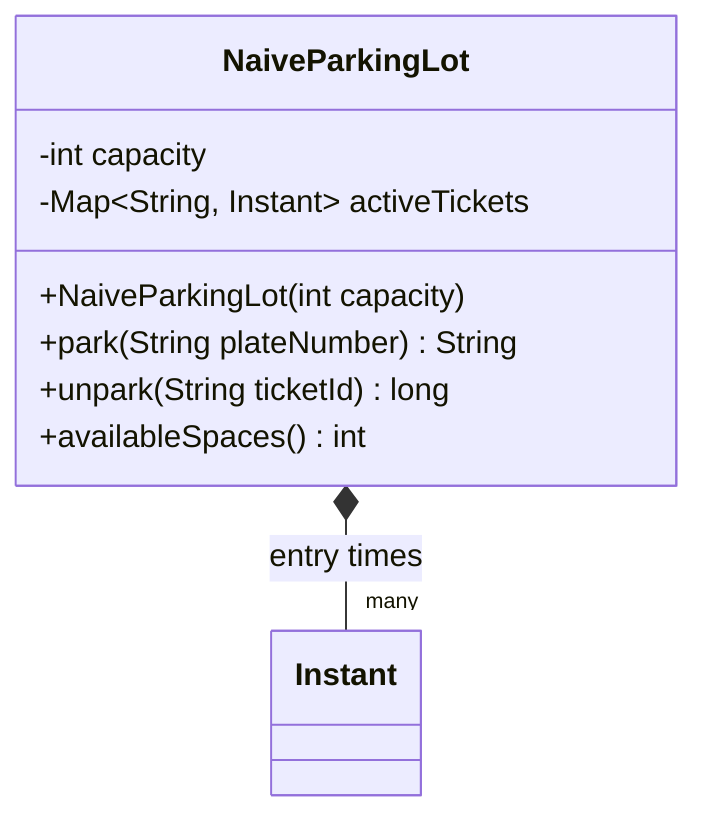
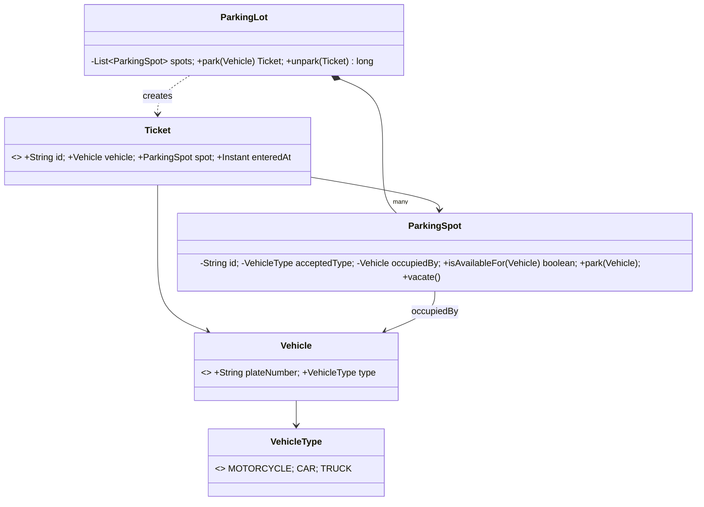
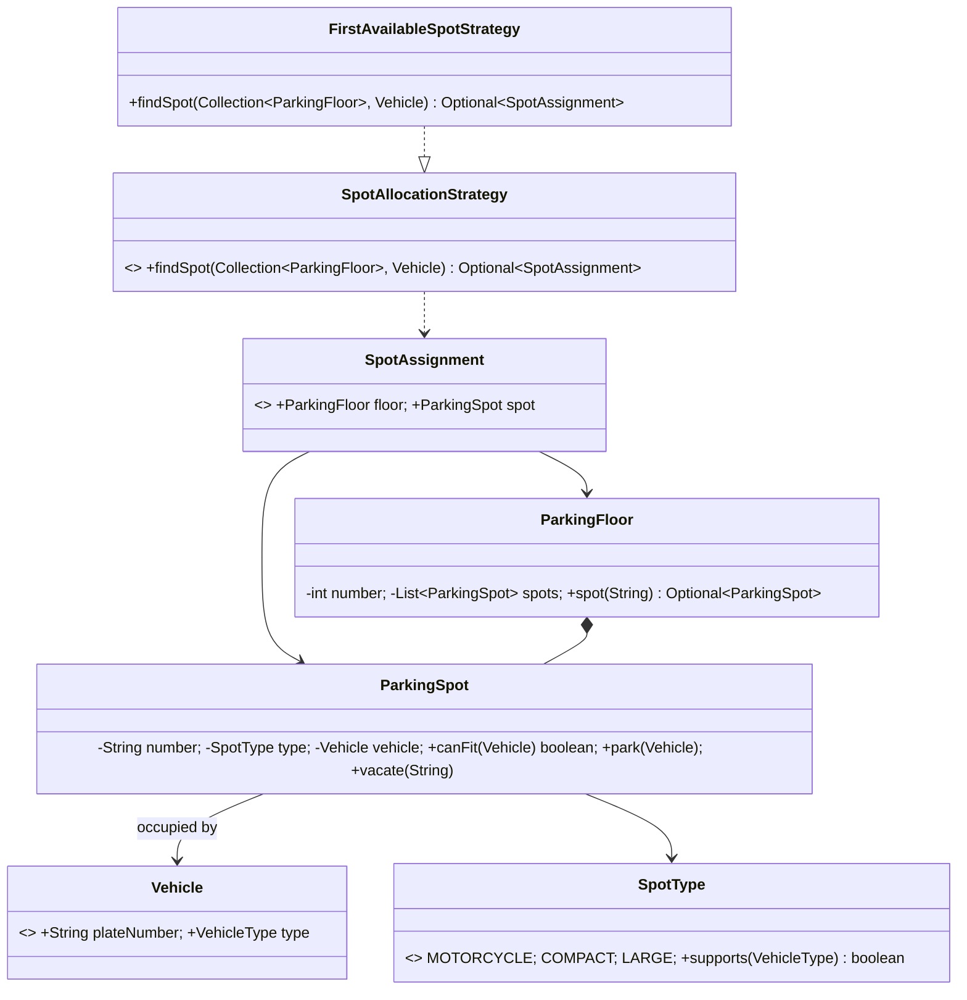

# Parking Lot LLD: an Evolutionary Case Study

This chapter deliberately begins with code that is too simple. At each stage, a concrete pain in the previous version motivates one small design improvement. The Git history mirrors that journey.

## Problem statement

Design a multi-floor parking lot. It should park compatible vehicles, issue tickets, unpark vehicles, calculate charges, and reveal availability. The system must be easy to extend without rewriting its central workflow.

## Requirements

### Functional

- Support `MOTORCYCLE`, `CAR`, and `TRUCK` vehicles.
- Support `MOTORCYCLE`, `COMPACT`, and `LARGE` parking spots.
- Allocate a compatible vacant spot when a vehicle enters.
- Issue a ticket at entry; reject entry when no compatible spot exists.
- On exit, calculate the fee, free the spot, and close the ticket.
- Show vacant/total spaces by type and floor.

### Non-functional and assumptions

- Correctness is more important than micro-optimization; allocation is initially linear.
- The model is in-memory and single-process. A production system would add persistence, transactions, authentication, and concurrency control.
- Money uses `BigDecimal`, never `double`.
- A vehicle has one active ticket at a time. A ticket is immutable except for its exit time.
- A rate starts at entry. For this chapter, billing rounds up to whole hours.

## Evolution map

| Version | Pain discovered | Improvement |
|---|---|---|
| 0 | One class does everything | Establish a deliberately naive baseline |
| 1 | Mixed responsibilities | Separate the domain objects |
| 2 | New allocation rules edit core code | Strategy for spot allocation |
| 3 | New tariffs edit exit flow | Strategy for pricing |
| 4 | Multi-floor queries leak everywhere | Aggregate floors and use repositories |

The following commits progressively add each stage. The final sections and source links are added when the final design is in place.

## Version 0 — simplest possible design

Our first implementation has one `NaiveParkingLot`: it stores tickets, counts capacity, validates exits, and calculates a hard-coded fee. Its only purpose is to make the next problems visible. See [the source](src/main/java/com/hrsvd/parkinglot/v0/NaiveParkingLot.java).



This is acceptable for a five-minute prototype: it can park by plate and charge a flat hourly fee. But it cannot express vehicle sizes, physical spots, floors, payment, or different rate rules. More importantly, every new requirement changes this one class.

### Problem 1: a god class

**Problem.** Entry, parking inventory, tickets, time calculation, and pricing are coupled in `NaiveParkingLot`.

**Why it is bad.** A change to any one concern risks the others. Unit tests must construct the entire lot to test a tariff, and neither vehicles nor spaces have meaningful domain behavior.

**OOP/SOLID signal.** This violates the Single Responsibility Principle (SRP): a class should have one reason to change.

**Solution.** Extract domain concepts: `Vehicle`, `ParkingSpot`, and `Ticket`; let a focused `ParkingLot` coordinate them. Version 1 introduces these concepts before adding patterns.

## Version 1 — model the domain

Version 1 moves state and behavior to the objects that own it. A `ParkingSpot` decides whether it can accept and park a vehicle; a `Ticket` records the parking event; `ParkingLot` orchestrates entry and exit.



**What changed from Version 0.** We can now point to a physical spot and a vehicle on every ticket, and spot invariants live in `ParkingSpot`. This is SRP in practice. There is no pattern yet: plain objects are the clearest tool.

### Problem 2: allocation policy is embedded in the workflow

**Problem.** `ParkingLot.park` selects the first compatible space itself. “Nearest entrance”, “lowest floor”, or “electric-vehicle priority” would each require editing the orchestrator.

**Why it is bad.** Policies vary independently from the parking workflow. Conditionals grow, and testing a policy requires testing the whole lot.

**OOP/SOLID signal.** This violates Open/Closed Principle (OCP) and Dependency Inversion Principle (DIP).

**Solution.** Depend on a `SpotAllocationStrategy` abstraction; pass a concrete strategy into the lot. This is the Strategy pattern because the algorithm is selectable at runtime.

## Version 2 — make allocation replaceable

The final package begins here. `SpotAllocationStrategy` owns only the question “which usable space should be chosen?” and returns a `SpotAssignment`; `FirstAvailableSpotStrategy` is the default rule.



**What changed from Version 1.** Compatibility moved from one rigid enum equality check to `SpotType.supports`, and allocation became a dedicated pluggable algorithm. The orchestration service can remain unchanged when product asks for “closest spot.”

### Problem 3: pricing is another volatile rule

**Problem.** A flat return value or tariff in the exit flow cannot support different vehicle prices, grace periods, weekends, or dynamic pricing.

**Why it is bad.** It combines lifecycle management with a business rule likely to change, making changes risky and hard to test.

**OOP/SOLID signal.** Again SRP/OCP/DIP apply: the coordinator should depend on a pricing abstraction, not a concrete tariff.

**Solution.** Add a `PricingStrategy`. It receives a completed ticket and returns a `BigDecimal`; the default implementation rounds duration to a whole hour.

## Build and run

```bash
mvn test
```
