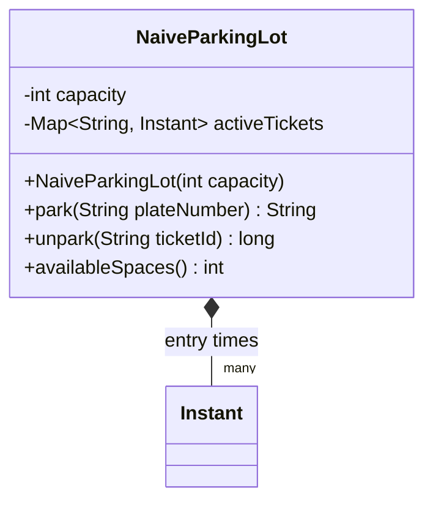
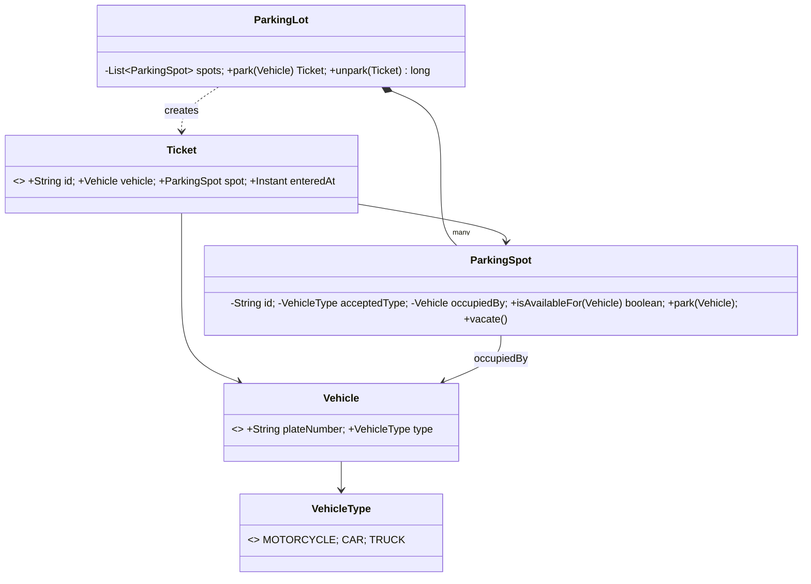
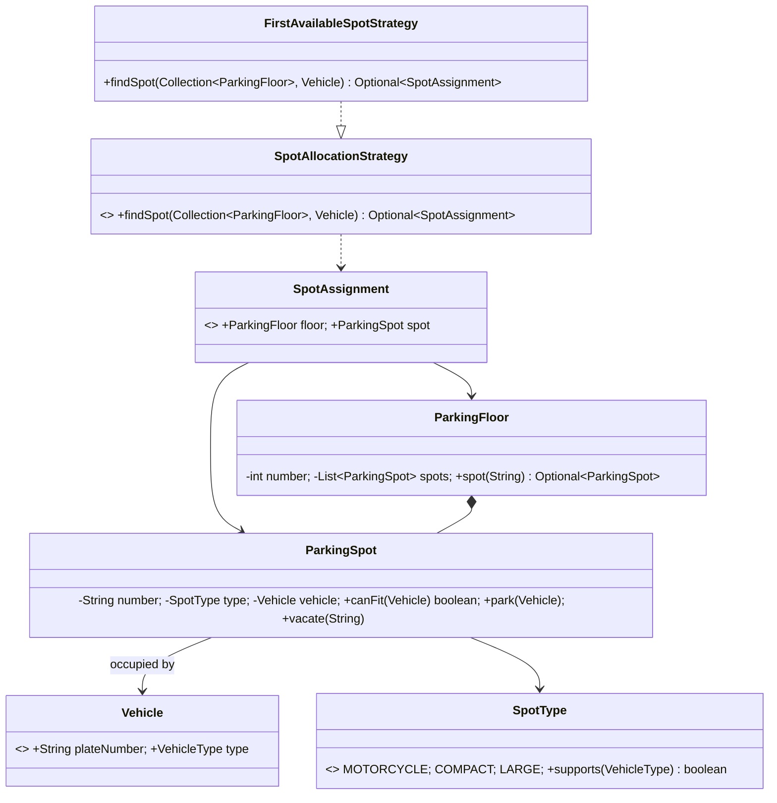
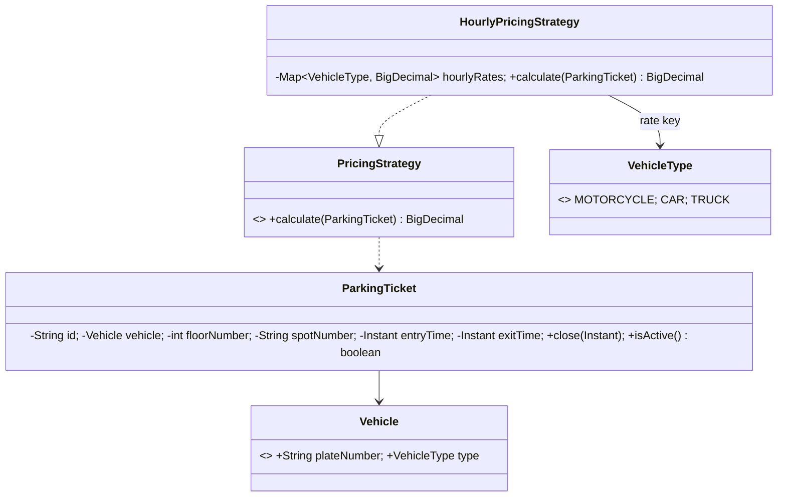
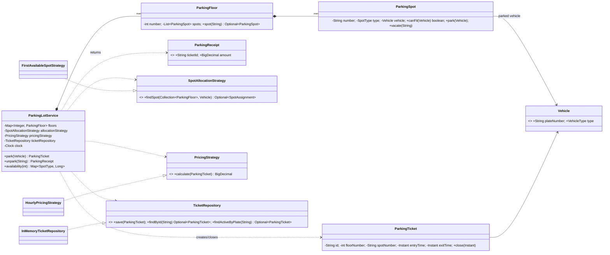

# Parking Lot LLD: an Evolutionary Case Study

This chapter deliberately begins with code that is too simple. At each stage, a concrete pain in the previous version motivates one small design improvement. The Git history mirrors that journey.

## Problem statement

Design a multi-floor parking lot. It should park compatible vehicles, issue tickets, unpark vehicles, calculate charges, and reveal availability. The system must be easy to extend without rewriting its central workflow.

## Requirements

### Functional

- Support `MOTORCYCLE`, `CAR`, and `TRUCK` vehicles.
- Support `MOTORCYCLE`, `COMPACT`, and `LARGE` parking spots.
- Allocate a compatible vacant spot when a vehicle enters.
- Issue a ticket at entry; reject entry when no compatible spot exists.
- On exit, calculate the fee, free the spot, and close the ticket.
- Show vacant/total spaces by type and floor.

### Non-functional and assumptions

- Correctness is more important than micro-optimization; allocation is initially linear.
- The model is in-memory and single-process. A production system would add persistence, transactions, authentication, and concurrency control.
- Money uses `BigDecimal`, never `double`.
- A vehicle has one active ticket at a time. A ticket is immutable except for its exit time.
- A rate starts at entry. For this chapter, billing rounds up to whole hours.

## Evolution map

| Version | Pain discovered | Improvement |
|---|---|---|
| 0 | One class does everything | Establish a deliberately naive baseline |
| 1 | Mixed responsibilities | Separate the domain objects |
| 2 | New allocation rules edit core code | Strategy for spot allocation |
| 3 | New tariffs edit exit flow | Strategy for pricing |
| 4 | Multi-floor queries leak everywhere | Aggregate floors and use repositories |

The following commits progressively add each stage. The final sections and source links are added when the final design is in place.

## Version 0 — simplest possible design

Our first implementation has one `NaiveParkingLot`: it stores tickets, counts capacity, validates exits, and calculates a hard-coded fee. Its only purpose is to make the next problems visible. See [the source](src/main/java/com/hrsvd/parkinglot/v0/NaiveParkingLot.java).



This is acceptable for a five-minute prototype: it can park by plate and charge a flat hourly fee. But it cannot express vehicle sizes, physical spots, floors, payment, or different rate rules. More importantly, every new requirement changes this one class.

### Problem 1: a god class

**Problem.** Entry, parking inventory, tickets, time calculation, and pricing are coupled in `NaiveParkingLot`.

**Why it is bad.** A change to any one concern risks the others. Unit tests must construct the entire lot to test a tariff, and neither vehicles nor spaces have meaningful domain behavior.

**OOP/SOLID signal.** This violates the Single Responsibility Principle (SRP): a class should have one reason to change.

**Solution.** Extract domain concepts: `Vehicle`, `ParkingSpot`, and `Ticket`; let a focused `ParkingLot` coordinate them. Version 1 introduces these concepts before adding patterns.

## Version 1 — model the domain

Version 1 moves state and behavior to the objects that own it. A `ParkingSpot` decides whether it can accept and park a vehicle; a `Ticket` records the parking event; `ParkingLot` orchestrates entry and exit.



**What changed from Version 0.** We can now point to a physical spot and a vehicle on every ticket, and spot invariants live in `ParkingSpot`. This is SRP in practice. There is no pattern yet: plain objects are the clearest tool.

### Problem 2: allocation policy is embedded in the workflow

**Problem.** `ParkingLot.park` selects the first compatible space itself. “Nearest entrance”, “lowest floor”, or “electric-vehicle priority” would each require editing the orchestrator.

**Why it is bad.** Policies vary independently from the parking workflow. Conditionals grow, and testing a policy requires testing the whole lot.

**OOP/SOLID signal.** This violates Open/Closed Principle (OCP) and Dependency Inversion Principle (DIP).

**Solution.** Depend on a `SpotAllocationStrategy` abstraction; pass a concrete strategy into the lot. This is the Strategy pattern because the algorithm is selectable at runtime.

## Version 2 — make allocation replaceable

The final package begins here. `SpotAllocationStrategy` owns only the question “which usable space should be chosen?” and returns a `SpotAssignment`; `FirstAvailableSpotStrategy` is the default rule.



**What changed from Version 1.** Compatibility moved from one rigid enum equality check to `SpotType.supports`, and allocation became a dedicated pluggable algorithm. The orchestration service can remain unchanged when product asks for “closest spot.”

### Problem 3: pricing is another volatile rule

**Problem.** A flat return value or tariff in the exit flow cannot support different vehicle prices, grace periods, weekends, or dynamic pricing.

**Why it is bad.** It combines lifecycle management with a business rule likely to change, making changes risky and hard to test.

**OOP/SOLID signal.** Again SRP/OCP/DIP apply: the coordinator should depend on a pricing abstraction, not a concrete tariff.

**Solution.** Add a `PricingStrategy`. It receives a completed ticket and returns a `BigDecimal`; the default implementation rounds duration to a whole hour.

## Version 3 — make pricing replaceable

`HourlyPricingStrategy` has exactly one responsibility: convert a closed `ParkingTicket` into a monetary amount. It is deliberately stateless except for injected rate data.



**What changed from Version 2.** Allocation and tariff variation are now independent. A weekend rate can implement the same interface without changing parking or ticket code. The `ParkingTicket` explicitly guards its lifecycle: it cannot be closed twice or before entry.

### Problem 4: orchestration needs a stable boundary

**Problem.** We now have a floor model and replaceable rules, but nothing coordinates an atomic entry/exit workflow or retains tickets. Letting callers manipulate spots and tickets directly risks stranded spots and lost tickets.

**Why it is bad.** State persistence and application workflow are implicit. Moving from in-memory data to a database would force a rewrite of business logic.

**OOP/SOLID signal.** Encapsulation asks us to protect invariants; DIP asks the application service to depend on a ticket repository interface.

**Solution.** Introduce `ParkingLotService` as the use-case boundary and a small `TicketRepository` port. The service coordinates allocation, spot state, ticket storage, time, and pricing; it does not implement either policy.

## Version 4 — the interview-ready design

The final implementation protects the entry/exit workflow inside `ParkingLotService`. It owns the in-memory synchronization boundary; a database-backed implementation would replace that with a transaction and a row/optimistic lock around allocation. `Clock` is injected so time behavior is deterministic in tests.



**What changed from Version 3.** The policy interfaces are now used by a real application service rather than being isolated utilities. Active tickets are persisted through a port, each ticket identifies its exact floor and spot, and the service enforces the central invariants: no double parking, no exit twice, and no freeing another vehicle’s space.

## Complete Java implementation

The final code is Java 17 and uses Maven. The historical `v0` and `v1` packages are intentionally retained as learning snapshots; production code lives in these packages:

| Area | Files |
|---|---|
| Domain | [Vehicle](src/main/java/com/hrsvd/parkinglot/domain/Vehicle.java), [SpotType](src/main/java/com/hrsvd/parkinglot/domain/SpotType.java), [ParkingSpot](src/main/java/com/hrsvd/parkinglot/domain/ParkingSpot.java), [ParkingFloor](src/main/java/com/hrsvd/parkinglot/domain/ParkingFloor.java), [ParkingTicket](src/main/java/com/hrsvd/parkinglot/domain/ParkingTicket.java) |
| Application | [ParkingLotService](src/main/java/com/hrsvd/parkinglot/service/ParkingLotService.java), [ParkingReceipt](src/main/java/com/hrsvd/parkinglot/service/ParkingReceipt.java) |
| Allocation policy | [SpotAllocationStrategy](src/main/java/com/hrsvd/parkinglot/strategy/SpotAllocationStrategy.java), [FirstAvailableSpotStrategy](src/main/java/com/hrsvd/parkinglot/strategy/FirstAvailableSpotStrategy.java) |
| Pricing policy | [PricingStrategy](src/main/java/com/hrsvd/parkinglot/pricing/PricingStrategy.java), [HourlyPricingStrategy](src/main/java/com/hrsvd/parkinglot/pricing/HourlyPricingStrategy.java) |
| Persistence port | [TicketRepository](src/main/java/com/hrsvd/parkinglot/repository/TicketRepository.java), [InMemoryTicketRepository](src/main/java/com/hrsvd/parkinglot/repository/InMemoryTicketRepository.java) |
| Tests | [ParkingLotServiceTest](src/test/java/com/hrsvd/parkinglot/service/ParkingLotServiceTest.java) |

Run the tests with:

```bash
mvn test
```

## Why each piece exists

- `Vehicle` is a value object; it identifies the entrant and its size requirement.
- `SpotType` owns the compatibility rule, so the `ParkingSpot` has a meaningful `canFit` operation. A spot owns its occupied/unoccupied state and refuses invalid transitions.
- `ParkingFloor` is a composition of spots. It provides the physical grouping needed by allocation and availability without becoming a coordinator.
- `ParkingTicket` represents the parking session. It captures the entry location so exit does not search for a vehicle. `close` protects the session lifecycle.
- `ParkingLotService` is the application façade. It is the only type that coordinates a use case across aggregates and dependencies. It intentionally has no `if` chains for allocation or tariff policy.
- `SpotAllocationStrategy` is the Strategy pattern. Swap in `NearestEntranceStrategy` or `ElectricFirstStrategy` without changing `ParkingLotService`.
- `PricingStrategy` is another Strategy pattern. It makes per-hour, slab, weekend, grace-period, and subscription pricing independently testable.
- `TicketRepository` is a small Repository/port abstraction. `InMemoryTicketRepository` is suitable for the case study; a SQL adapter can implement the same contract.
- `Clock` is dependency injection for time. Tests advance a mutable clock rather than sleeping.

### SOLID, without ceremony

| Principle | Concrete application |
|---|---|
| SRP | Spot state, allocation, pricing, ticket persistence, and orchestration each have separate homes. |
| OCP | New allocation/pricing implementations extend behavior without editing `ParkingLotService`. |
| LSP | Any strategy or repository implementation can replace the supplied implementation while preserving its contract. |
| ISP | `TicketRepository` exposes only ticket operations the application needs. |
| DIP | The service depends on `SpotAllocationStrategy`, `PricingStrategy`, `TicketRepository`, and `Clock` abstractions, supplied through its constructor. |

## Common interview follow-ups

| Follow-up | Evolution |
|---|---|
| Nearest space / display boards | Add an allocation strategy backed by an index of free spots; update a display observer/event after `park` and `unpark`. |
| Multiple entrances and concurrent attendants | Use transactions plus optimistic/pessimistic locks or atomic “claim spot” SQL; do not rely on Java `synchronized` across processes. |
| Payments, failures, and refunds | Add a `PaymentService` port and `Payment` entity. Keep payment status on the ticket/receipt; use a saga/outbox for external payment events. |
| Reservations | Add `Reservation` with expiry and reserve/release states. Allocation must exclude reserved spots or use a reservation-aware strategy. |
| Electric, handicapped, or VIP spaces | Add spot capabilities/attributes and a policy that considers them; avoid a combinatorial subclass hierarchy. |
| Dynamic/slab pricing | Implement a new `PricingStrategy`, possibly based on a `RateCard` repository and entry/exit timestamps. |
| Persistence and audit | Implement `TicketRepository` with a database and store immutable parking events. Keep the domain API unchanged. |
| Multiple lots | Introduce a `ParkingLot` aggregate identifier and route to a service/repository per lot; floors remain nested under a lot. |

## What I learned from this problem

Start with the smallest working model, then let concrete change pressure decide the abstractions. A class is not “good LLD” because it has an interface; it is good when it owns one responsibility and its collaborators vary independently. In this design, physical state stays with spots and tickets, while volatile business algorithms become strategies. The result is compact enough to explain at a whiteboard and open enough to survive realistic follow-up requirements.

## Build and run

```bash
mvn test
```
